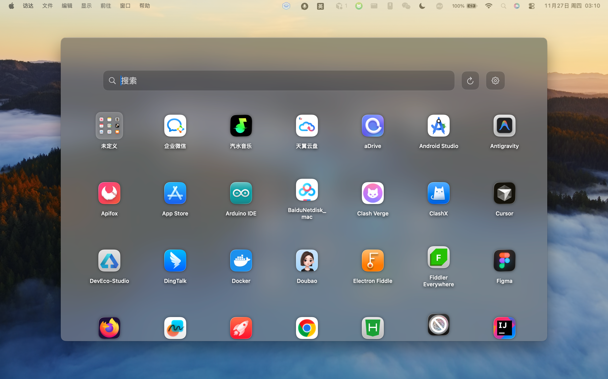
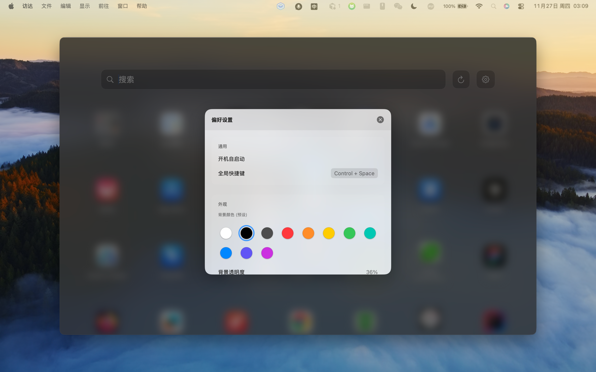

# MacLauncher - macOS 启动台替代品

Mac 升级到 26 版本后，启动台没了，先写一个简单的用着。

## 🌟 特性

- 🚀 **极速启动** - 秒开体验，流畅不卡顿
- ⌨️ **全局快捷键** - `Control + Space` 快速唤起
- 📂 **智能分组** - 拖拽合并应用，创建文件夹
- 🔍 **实时搜索** - 输入即搜，快速定位应用
- 🎨 **个性定制** - 自定义背景颜色和透明度
- 🤖 **开机自启** - 随系统启动，随时可用
- 🖥️ **沉浸体验** - 无边框设计，完美融入桌面

## 📸 截图

<!-- 将您的截图放到 docs/screenshots/ 目录下，然后在这里引用 -->
<!--  -->
<!--  -->

## 📥 下载安装

### 方式一：从 GitHub Releases 下载（推荐）

1. 访问 [Releases 页面](https://github.com/chinaliyun92/MacLauncher/releases)
2. 下载最新版本的 `MacLauncher.zip`
3. 解压后，将 `MacLauncher.app` 拖到 `应用程序` 文件夹
4. 双击运行即可

### 方式二：从源码构建

如果您想自己编译，请参考 [开发文档](DEVELOP.md)。

## 🚀 快速开始

### 首次使用

1. **运行应用**：双击 `MacLauncher.app` 启动
2. **授权权限**：系统可能会要求授权，请点击"允许"
   - 辅助功能权限（用于全局快捷键）
   - 应用程序文件夹访问权限
3. **首次扫描**：应用会自动扫描 `/Applications` 目录下的所有应用

### 基本操作

- **唤起启动台**：按 `Control + Space` 快捷键
- **关闭启动台**：
  - 按 `ESC` 键
  - 点击窗口外部区域
- **搜索应用**：在顶部搜索框输入应用名称
- **启动应用**：点击应用图标
- **拖拽排序**：拖动图标调整位置
- **创建分组**：将一个应用拖到另一个应用上自动创建文件夹

## ⌨️ 快捷键

| 快捷键            | 功能                    |
| ----------------- | ----------------------- |
| `Control + Space` | 全局唤起/隐藏启动台     |
| `ESC`             | 关闭文件夹 / 隐藏启动台 |
| `Cmd + Q`         | 退出应用                |
| `Cmd + W`         | 隐藏窗口                |

## ⚙️ 设置

点击启动台右上角的 **⚙️ 设置按钮**，可以：

- **开机自启动**：开启后应用会随系统启动
- **背景颜色**：从 10 种预设颜色中选择
- **背景透明度**：调整背景遮罩的透明度（0-100%）

## 📋 系统要求

- macOS 14.0 (Sonoma) 或更高版本
- 支持 Apple Silicon (M1/M2/M3) 和 Intel 芯片

## ❓ 常见问题

### Q: 为什么快捷键 `Control + Space` 无效？

**A**: 可能与其他应用或系统快捷键冲突。请检查：

- 系统偏好设置 → 键盘 → 快捷键
- 其他应用的全局快捷键设置

### Q: 为什么有些应用没有显示？

**A**: 应用只扫描 `/Applications` 目录。如果应用安装在其他位置，请使用刷新按钮手动刷新，或者将应用移动到 `/Applications` 目录。

### Q: 应用无法启动？

**A**:

1. 检查系统版本是否满足要求（macOS 14.0+）
2. 在"系统设置 → 隐私与安全性"中，授予"辅助功能"权限
3. 如果从网上下载，可能需要右键点击应用 → "打开"，绕过安全限制

### Q: 如何完全退出应用？

**A**:

- 方法一：点击菜单栏图标 → "退出"
- 方法二：按 `Cmd + Q`

## 📄 许可证

本项目采用 MIT 许可证。详见 [LICENSE](LICENSE) 文件。

## 🤝 贡献

欢迎提交 Issue 和 Pull Request！

## 📞 反馈

如有问题或建议，请访问 [GitHub Issues](https://github.com/chinaliyun92/MacLauncher/issues)。

---

**享受更流畅的应用启动体验！** 🎉
